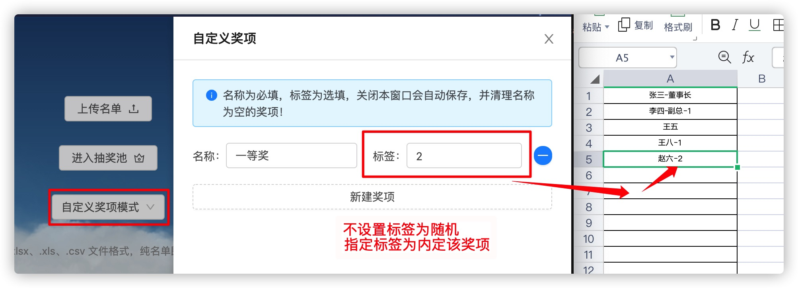

# DZMLuckyDraw

HTML 5 网页端年会抽奖源码，只需要导入名单列表即可，可内定中奖人员！

支持模式：直接抽取、自定义奖项抽取

内定功能：支持

导出中奖名单：支持

抽奖详细使用介绍地址：[CSDN 抽奖使用介绍](https://blog.csdn.net/zz00008888/article/details/117024570)

# 使用说明

    0、index.html: 主入口，lucky-draw.html 为抽奖页面。
    1、关闭窗口、刷新网页都不会清空用户名单、中奖名单、奖项配置，所以误操作也没事，可以重新直接进入抽奖页继续操作，流程保持不变。
    2、必须手动在主页 index.html 中点击清空数据，才会清理用户名单、中奖名单、奖项配置等所有配置，相当于重置，否则在同一浏览器中会一直保留。
    3、支持 .xlsx、.xls、.csv 文件格式上传
    4、支持自定义奖项模式、默认抽奖模式
    5、已经中过奖的人不会重复中奖
    6、在上面支持的文件格式中每个单元格是一个用户
    7、每个单元格支持的用户格式，可以混合存在文件中：
    （没有设置指定第几轮中奖的会完全随机抽，所以不需要内定的时候，不要用设置第几轮中奖的名单方式就行了）

      名字
      名字-部门(或职位, 或描述)
      名字-第几轮中奖(只能数字，不设置随机)
      名字-部门(或职位, 或描述)
      名字-部门(或职位, 或描述)-第几轮中奖(只能数字，不设置随机)

      注意：第几轮中奖(只能数字，不设置随机) 这一项在自定义奖项模式、默认抽奖模式中用法一样，作用不同。
      默认抽奖模式：指的是第几轮中奖
      自定义奖项模式：这个模式下就不会按轮来进行中奖，对应的是自定义奖项时填写的标签，如果一个自定义奖项的标签设置为1，然后选择这个奖项抽奖时，用户列表里面有按上面模式设置了1的用户则会中奖，这个标签是可选项，不设置就完全随机，如果设置就会去名单列表中找到匹配的用户。

      例如：
      
      张三
      李四-1
      王五-财务部
      赵六-副总-2

# 使用效果

# 自定义奖项模式配置

  
